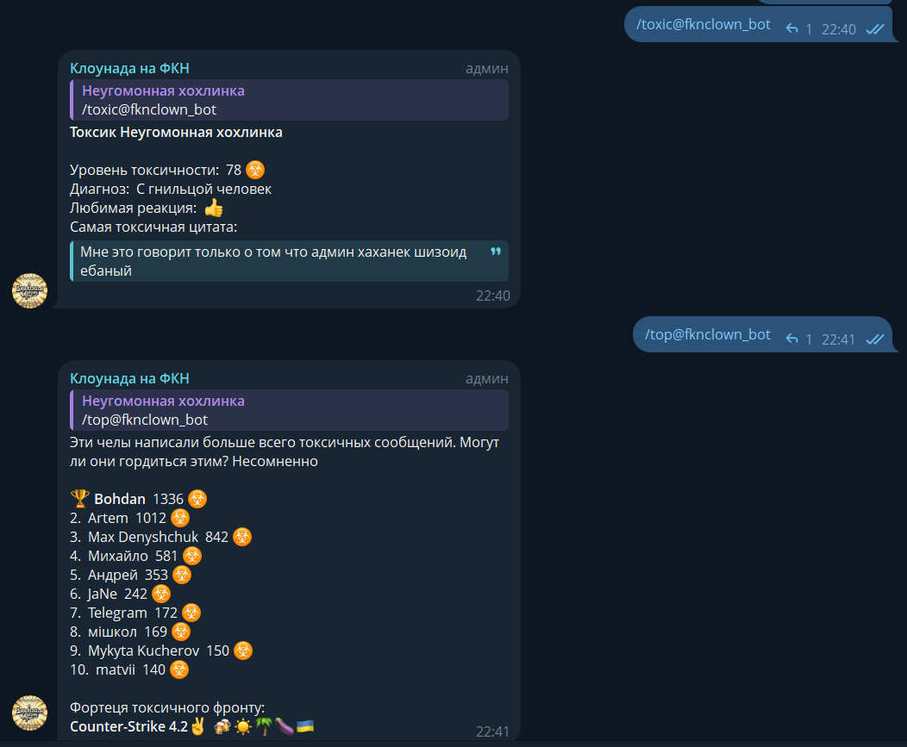

# Funny telegram bot for analyzing message toxicity

This is a telegram bot that uses a neural network via API to analyze the toxicity of each message in the chat. The bot
leaves a "😈" reaction to toxic messages and counts their number for each chat and for each user. The bot also has a
web app for drawing and several funny commands for processing user avatars. Try the bot: https://t.me/fknclown_bot

### Used technology

* Python 3.12
* Aiogram 3.x - asynchronous framework for Telegram Bot API
* FastAPI - asynchronous http server
* PostgreSQL - relational database
* SQLAlchemy 2.x - object–relational mapper (ORM) for database interactions
* [Perspective API](https://www.perspectiveapi.com) - service for analyzing the toxicity of comments
* Docker - platform that enables developers to run containerized applications

### Installation

* Run the PostgreSQL database
* Edit file `example.env` and fill it with your data including the data for connecting to the database, then rename it
  to `.env`. This file contains all the bot settings
* Run docker container with commands:  
  `docker build -t <image_name>`  
  `docker run <image_name>`